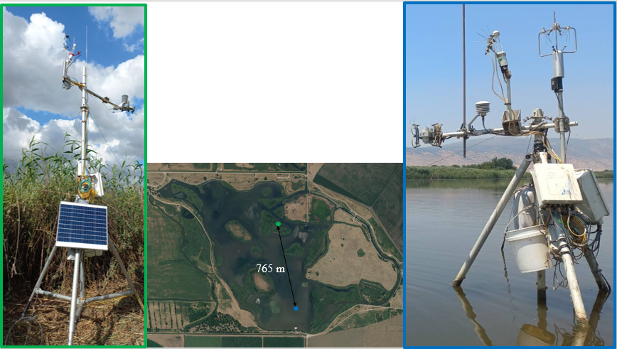

# Time Series Analyses for Environmental Sciences

This repository contains a collection of time series analyses I've conducted as part of the course "*71606 Time Series Analysis for Environmental Sciences*" (link to the course website: [https://yairmau.com/time-series/](https://yairmau.com/time-series/)).

# Introduction

This study delves into the intricate dynamics of the Hula Lake ecosystem in Israel (N 33° 6.200040 E 35° 36.380760), employing a comprehensive analysis of meteorological and remote sensing data. The overarching goal is to elucidate the environmental impacts of water and vegetation factors within this unique lacustrine environment, with a particular emphasis on describing the changes between the lake and the vegetation affecting the energy balance and carbon emissions.

Wetlands contain a disproportionate amount of the earth’s total soil carbon; holding between 20 and 30% of the estimated 1,500 Pg of global soil carbon despite occupying 5–8% of its land surface [[Nahlik and Fennessy., 2016](https://www.nature.com/articles/ncomms13835)], underscoring the necessity to isolate and monitor the various factors within these ecosystems. This project aims to achieve an initial understanding of the differences in the annual and daily ranges of various parameters between the water station and the vegetation station, paving the way for future forecasting and linking remote sensing data to physical parameters.

## Data Acquisition

The dataset comprises in-situ measurements obtained from two strategically positioned meteorological stations: one situated on the lake's water surface and the other on a vegetated island within the lake (Fig 1). These stations meticulously recorded a myriad of atmospheric and hydrological parameters, including:

- Temperature
- Relative humidity
- Wind speed and direction
- Energy balance components
- Water fluxes
- Carbon dioxide levels
- Evaporation
- Precipitation

Additionally, remotely sensed data from the Sentinel-2 satellite was acquired, spanning the period from 2017 to 2024, with a temporal resolution of 5 days and a spatial resolution of 10 meters.

**Figure 1** - Map of the Hula Lake ecosystem, depicting the locations of the water and vegetation meteorological stations.

## Project Summary
This study investigates the environmental dynamics of the Hula Lake ecosystem in Israel, focusing on the relationship between water and vegetation factors and their impact on the energy balance and carbon emissions. The project aims to elucidate the differences in annual and daily ranges of various parameters between a water station and a vegetation station within the lake.

The analysis is divided into two parts:

### Near-Term Analysis

This part focuses on high-frequency meteorological data collected from October 2023 to February 2024. The analysis includes data preprocessing, comparison of daily trends between the water and vegetation stations, and cross-correlation analysis to quantify time differences.

### Long-Term Analysis
This part utilizes remotely sensed data from the Sentinel-2 satellite to generate time series of average NDVI (Normalized Difference Vegetation Index) values for the lake water and the vegetated island. The analysis involves smoothing, resampling, decomposition, and observation of annual trends in vegetation dynamics.

Throughout the project, rigorous scientific standards are maintained, employing appropriate statistical techniques and data visualization methods to effectively communicate the findings.

The overall goal is to provide an initial understanding of the differences in the annual and daily ranges of various parameters between the water and vegetation stations, paving the way for future forecasting and linking remote sensing data to physical parameters within the Hula Lake ecosystem.

### Tools and Functions Used

**Data Preprocessing:**
- Handling missing data
- Outlier detection and removal
- Date/time formatting

**Data Analysis:**
- Time series generation
- Trend and seasonality decomposition
- Cross-correlation analysis
- Smoothing and resampling techniques
- Stationarity
- Auto-Correlation
- Arima
